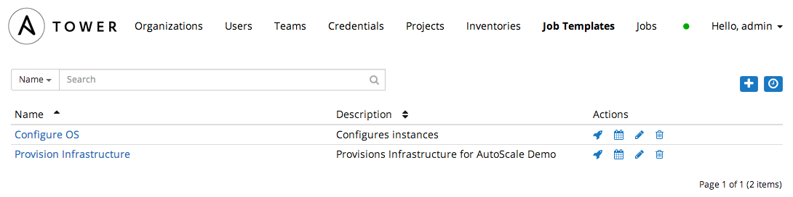
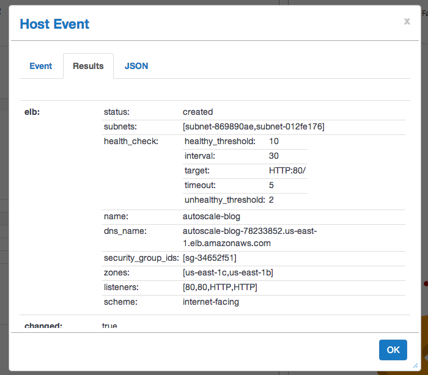

# Provisioning an Autoscaling Infrastructure using Ansible 


## About Autoscaling

The concepts behind [Amazon's Auto Scaling Groups (ASGs)](http://aws.amazon.com/autoscaling/) are very promising.  Who wouldn't want to have their infrastructure scale automatically with increases and decreases of demand?  Plenty of folks are using ASGs to do that today.  ASGs do bring about their own challenges:

* How do I manage my ASGs and the components that often go along with them ( Elastic Load Balancers, Launch Configurations, AutoScale Policies and Alarms).  
* How do I configure the newly spun up instances?   
* Should I pre-bake my docs/images or configure them at run time?  
* How do I provide rolling updates to an ASG?  

This is the beginning of a series of articles designed to address these points.


## Ansible and Autoscale Groups

Ansible supports these common components of EC2 AutoScale Infrastructure:


| EC2 Term  | Ansible Module |
|-----------------------------|------------------------------|
| Auto Scale Group | [ec2_asg](http://docs.ansible.com/ec2_asg_module.html) |
| Auto Scaling Policy | [ec2_scaling_policy](http://docs.ansible.com/ec2_scaling_policy_module.html) |
| CloudWatch Alarms | [ec2_metric_alarams](http://docs.ansible.com/ec2_metric_alarm_module.html)  |
| Elastic Load Balancer | [ec2_elb_lb](http://docs.ansible.com/ec2_elb_lb_module.html) |
| Launch Configuration |[ec2_lc](http://docs.ansible.com/ec2_lc_module.html) |


These Ansible modules are available in Ansible core today and will be used extensively in our examples.  We'll be using Ansible to manage each one of these components.


## Stock AMI provisioning

The idea behind provisioning a stock AMI to your ASG is very appealing.  You don't have to manage an ever-growing list of "Golden AMIs" or the environment to actually build one.  You simply rely on the effectiveness to configure a stock AMI at ASG instance launch time.   Let's examine how that works with Ansible.

To demonstrate this concept, we're going to use [Ansible Tower](http://www.ansible.com/tower).  Ansible Tower features a callback mechanism -- this allows for newly created servers to request an Ansible configuration run.  Here's  simple workflow describes how this would work in an AWS environment with ASGs.

1. Instance launch in ASG is triggered (ASG creation, event notification, parameter change, etc)
2. When instance boots, it executes a script that makes an authenticated request to the Tower server, asking to be configured.
3. Ansible Tower kicks off a job that configures the server.


Rather than just telling how what it can do, we'd much rather show you.  In this very Github project, you'll find Ansible code to test out this very feature.  The next few steps of this article are going to show you how to set this up!


## Setting Up Your AWS Environment for Ansible Tower

For those of you who are already running Tower in your environment, you might just be able to skip ahead to the next step.

If not, [please follow these instructions](docs/tower_setup.md) on how to setup Tower in your AWS environment.


## Setting up Tower to pull playbooks from GitHub

To add this project to Tower, perform the following steps:  

Click the Projects Tab, and click the + icon to add a new project.  Fill in the form as described below. 

SCM Url:  https://github.com/ansible/autoscale_blog.git


## Creating the Job Templates

We are going to use 2 seperate job templates, one for provisioning the requisite EC2 infrastructure, and one for configure the instances in an autoscale group.

### Creating the Configuration Template
This template will be used to configure the applications -- it is launched with config.yml playbook.


Click on the **Allow Callbacks** check box.  After doing so two additional textboxes  will appear: Callback URL and Host Config Key.

Click on the Magic Wand icon to the right of the Host Config Key text box.

After hitting Save, a dialog will appear with the call back URL and Host Key.  Make note of the host configuration key and the job template ID (highligthed below).  These are unique to your Tower install, so please do not use the values below, they are only provided for example.


Host callbacks are enabled for this template. The callback URL is: /api/v1/job_templates/3/callback/
The host configuration key is: ``` f1d8ab1d45b51be67afe372360f6c85c```


## Creating the Infrastructure Provisioning Job Template

This job template will be used to spin up the EC2 infrastructure using the infra.yml playbook.  


In the Extra Variables section, paste in the following in, making sure you substitue the key_name, vpc_id, tower_group, tower_address, template_id, and host_config_key with the values we discovered earlier. If you're using a region other than us-east1, you'll have to substitue the proper AMI for a RHEL 6.5 instance as well.


	region: us-east-1
	app_name: autoscale-blog
	subnets:
	- subnet-33e4ec1b
	tower_callback_client_group_id: sg-c6246ea3
	tower_client_group_id: sg-c6246ea3
	vpc_id: vpc-b95cf2dc
	ami: ami-8d756fe4
	max_size: 4
	min_size: 2
	desired_capacity: 2
	key_name: jmartin-autoscale-blog
	tower_address: 10.0.1.131
	template_id: 3
	host_config_key: f1d8ab1d45b51be67afe372360f6c85c
	instance_size: m1.small


Assign the AWS credentials we created earlier using the **Cloud Credentials** dialog.  When launched,  template will create the following items:

### EC2 Infrastructure 

| Item  | Description |
|-----------------------------|------------------------------|
| App Security Group | Self-referencing group that allows members of this group to access all ports of members. |
| Load Balancer | A load balancer for the app servers. |
| Launch Configuration | A configuration used by the AutoScale group. |
| AutoScale Group | Defines the number of instances and the load balancer membership. |
| Scale Up & Down Policies | Policies that when alarmed will dictate change to occur on AutoScale group.  |
| Scale Up & Down Alarms | Alarms that will trigger their relative scale up and down policies. |


## Running the Playbooks

First we'll need to provision the AWS infrastructure, and we'll kick that off interactively.  Click the rocket icon next to the *Provision Infrastructure* job template.




You'll be taken to a new screen that will show you the status of your job run.  When that job run is complete, i tshould look something like this:


We need to get the CNAME of the ELB that was launched and we'll use this to verify that instances are actually server web pages later. To do so, click on the task that says "launch load balancer". Then Under *Host Events*, click the localhost item.


Now a new window pops up, showing the result of that particular task.  Click the *Results* tab and see find the *dns_name*.  Make note of it.  We'll use that in our browser later to make sure everything is working.



While you've been performing these actions, the following has happened

1. The EC2 infrastructure playbook is run and all EC2 components described in the EC2 infrastructure table are created.
2. The AutoScale Group is created and the initial 2 instances are launched
3. That script phones home to Tower and requests Tower to configure the server with the template ID (in this case, the Configure Application template) that is in the URL.
4. Tower checks to make sure that the instances are part of the inventory specified in the job template and also validates the host configuration key.
5. Tower then configures the instances with the Configure OS job template.
6. Instances are reachable via the load balancer URL.


You can verify the callback happened by taking a look back at the Jobs tab.  You should see 2 new jobs with the name of *Configure OS*.  Those were the jobs that were launched via the callback mechanism.


Now to top if all off, let's curl the ELB CNAME we gathered earlier and verify that we're actually serving content:


	myshell:~ curl autoscale-blog-78233852.us-east-1.elb.amazonaws.com
	This is a test - Ubuntu 12.04  <br>
	Current Host: ip-10-11-3-49 <br>


## Additional Testing

You can tweak our ASG group to increase the number of instances, or create traffic that causes a trigger to initiate an AutoScale event to test further.


That's all, all folks!


