# Provisioning an Autoscaling Infrastructure using Ansible Tower

## Introduction

This article's goal is to show you how to provision EC2 AutoScale instances with Ansible Tower.  This is for demonstration purposes only.  Security group rules presented here are ***not*** recommended for production use.  Please adapt the security group rules to meet your organizational needs.


## Requirements

Autoscaling is dependent on Ansible Tower's callback mechanism.  For those who aren't familiar, Tower is our commercial product.  It's free-for-life if your are using 10 servers or less.

In our case, we'll be using the Ansible Tower AMI available on the AWS Marketplace to speed up the process.


## Setting up the Tower Environment

### VPC and Subnets

* Create or use a VPC.  Make note of VPC ID.
* Create or use 2 or more subnets in VPC that are in unique Availability Zones. The Subnets should be able to route to out to the Internet. Make note of Subnet IDs. 


### Create a Security Group for Tower


In the EC2 console, we need to create 3 security groups (for the lazy, see the appendix for an Ansible playbook that will configure all of this):

* one for the instances that will be using Tower's call back feature
* one for the Tower server itself that allows you to SSH to Tower and use Tower's web interface.
* one for the instances that Tower will SSH into.


####Tower Callback Client Security Group

This is a group without any rules.  It will be assigned to the Launch Configuration of the instances that require callback access.  Make a note of the group ID after it is created.

  


####Tower Server Security Group
Create a custom security group for your Tower instance to live in.  I give myself access to SSH and HTTPS, and I give members of the security group I created above access to HTTPS as well.  Make a note of the group ID after it is created.

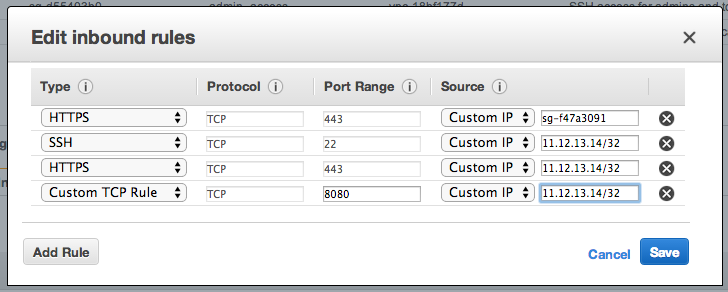  

The security group should allow you to SSH into the Tower instance, have HTTPS access to the Tower instances, and should be reachable by HTTPS by your managed instances for the callback feature to work.  

#### Tower Client Security Group
This group is assigned to the instances that are managed by Tower.  It allows Tower to SSH into the instances.

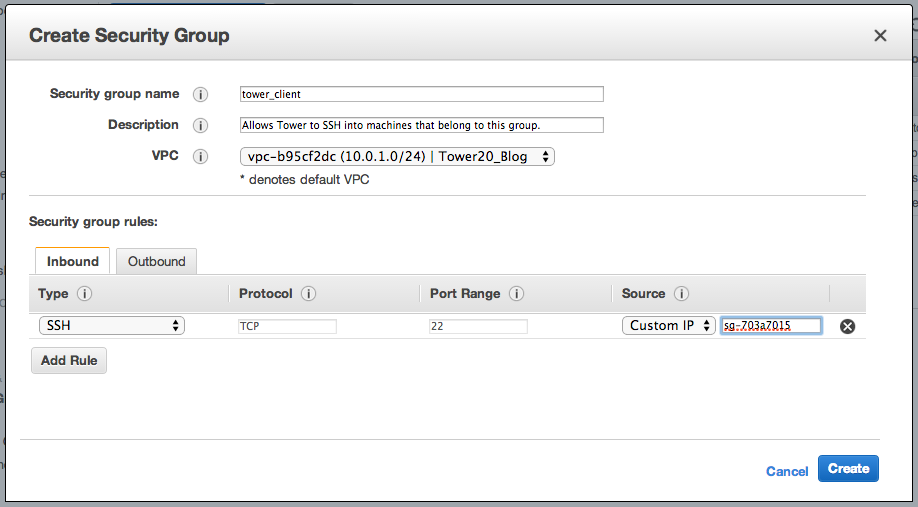


### Launching the Tower instance
First launch the Tower AMI into the EC2 region of your choice. [Follow this link](http://www.ansible.com/tower) and click on the **Launch Tower in EC2** button.  You'll be greeted with a simple form to fill out.


After that, you'll be presented with a CLICK HERE link.  When you click that you'll be redirected to AWS.

For our testing purposes, we'll be launching the Ansible Tower (10 instances) license.  There's no additional charge to use this other than the standard EC2 operating charges.  Go ahead and click on that, and then on the next page, click on the yellow continue button.

On this page, we'll make sure that we're selecting the latest version of Tower available on AWS.  At the time of this writing, that version is **UPDATEME**.  For the purpose of this article we'll be using US East.  The default instance type for Tower is m1.large, so go ahead and leave it at that for now.

As far as the VPC is concerned, we'll be launching ours into our default VPC.  Choose an appropriate Subnet for your VPC also.

The default security group is going to allow SSH, HTTP, and HTTPS.  I'd recommend you restrict the IP addresses that are allowed to connect to these ports as well.

Finally, select the EC2 keypair to use to launch your instance, and click the Launch button at the top right of the screen.


## Gather some information 
 
We need to gather some bits of data from the AWS console to supply as variables to our playbooks.

We'll also need to gather the VPC ID that we'll be using for the demo.  For the purposes of this demo, it should be the same VPC ID we used to launch the Tower instance.  

Hold on to this information for now, we'll user it later.

## Basic Tower Configuration

Find the public address of the Tower instance you just launched in the EC2 console.  We'll ssh to it find the randomally generated admin password for tower in the login message:

	ssh ubuntu@myinstance.compute-1.amazonaws.com
	Welcome to Ubuntu 12.04.4 LTS (GNU/Linux 3.2.0-60-virtual x86_64)
	
	  Welcome to AnsibleWorks AWX!
	
	  Log into the web interface here:
	
	    https://myinstance.compute-1.amazonaws.com/
	
	    Username: admin
	    Password: 2v9P7rmpfsHd
	
	  The documentation for AWX is available here:
	
	    http://www.ansibleworks.com/ansibleworks-awx/
	
	  For help, email support@ansibleworks.com.
	
	7 packages can be updated.
	3 updates are security updates.
	

Now open your browser and go to https://myinstance.compute-1.amazonaws.com and login to Tower with admin as the user and the password you found in the previous step.

## Create an Organization


Firstly, you'll want to create an Organization, typically named after the Organization you're working for.  In this case, we'll call our organization MyOrg.

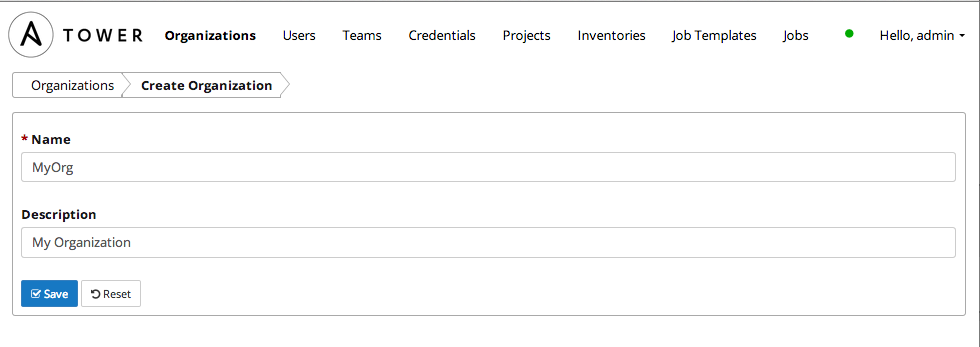

We don't need to create any additional users or teams for the purposes of this demo.

## Configuring Tower Credentials

The next step is to configure some credentials for Tower.  Click on the Credentials tab and then click on the + icon to add a new set of credentials. 

### AWS Credentials:

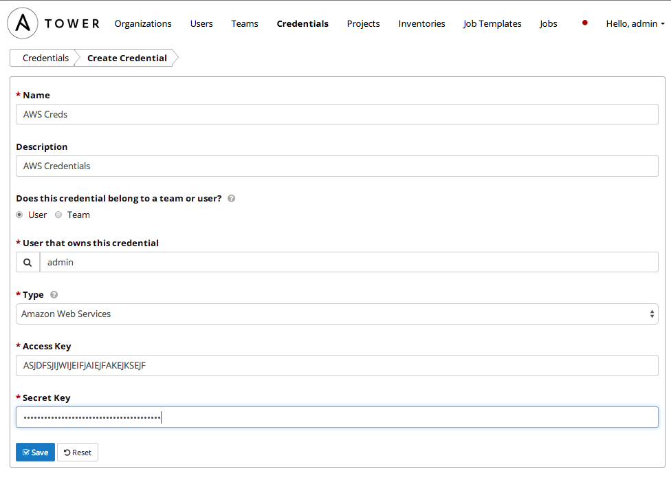

### SSH Credentials

Now we'll configure a set of credentials that Tower will use to SSH to the instances.  

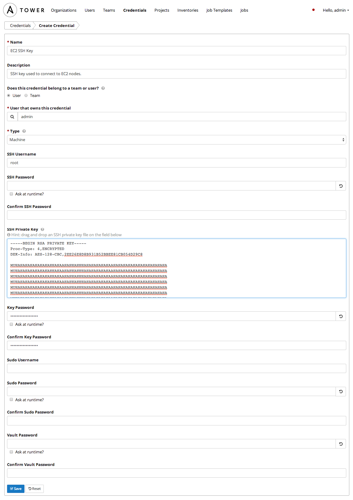


## Setting up Tower to pull playbooks from GitHub

I've already created a project on Github that covers what we need to do.  That project [can be found here](https://github.com/jsmartin/the_light).  To add that project to Tower, perform the following steps:  

Click the Projects Tab, and click the + icon to add a new project.  Fill in the form as described below:

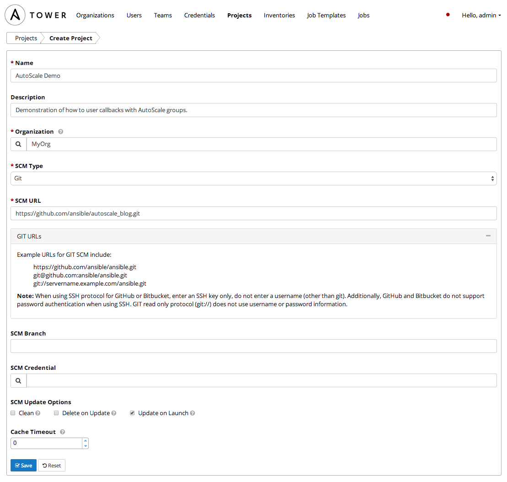


## Configuring Tower to synchronize EC2 inventory

### Create the Inventory

Click on the Inventory tab and click on the + icon to add a new inventory and fill out that form as below:

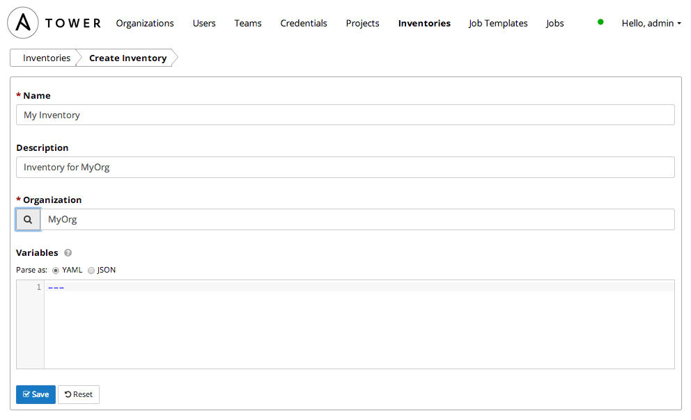


### Create the Inventory Group
Click on the newly created Inventory and click the + symbol to add a new group.  Fill out the form as below:

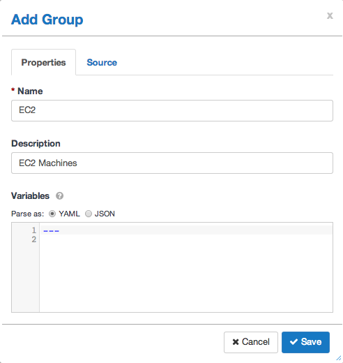

Click the Source tab and fill out the form as below:


Now click on the **Start sync process** icon.  


## Creating the Job Templates

We are going to use 2 seperate job templates, one for provisioning the requisite EC2 infrastructure, and one for configure the instances in an autoscale group.

### Creating the Configuration Template
This template will be used to configure the applications -- it is launched with config.yml playbook.

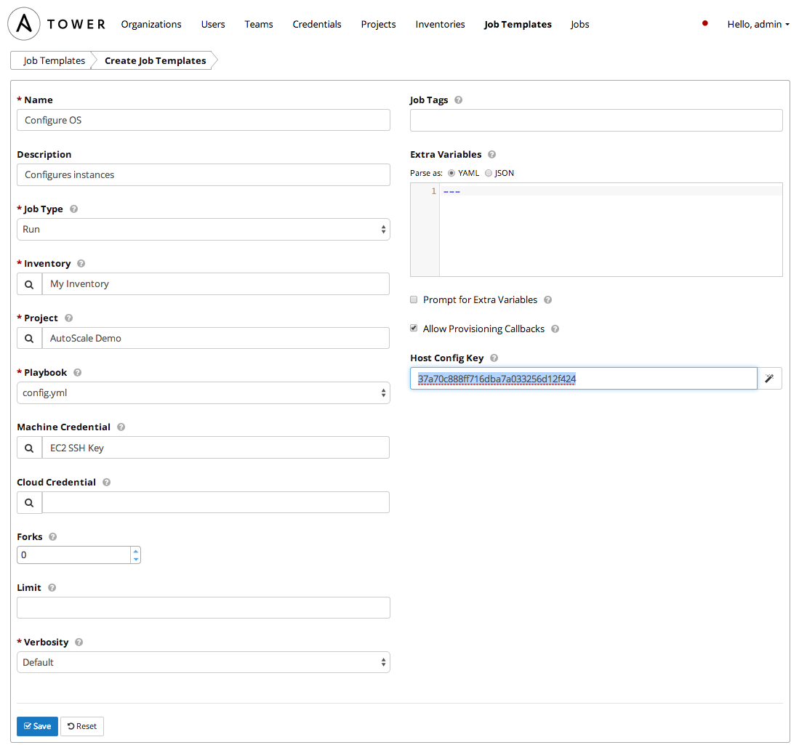

Click on the **Allow Callbacks** check box.  After doing so two additional textboxes  will appear: Callback URL and Host Config Key.

Click on the Magic Wand icon to the right of the Host Config Key text box.

After hitting Save, a dialog will appear with the call back URL and Host Key.  Make note of the host configuration key and the job template ID (highligthed below).  These are unique to your Tower install, so please do not use the values below, they are only provided for example.

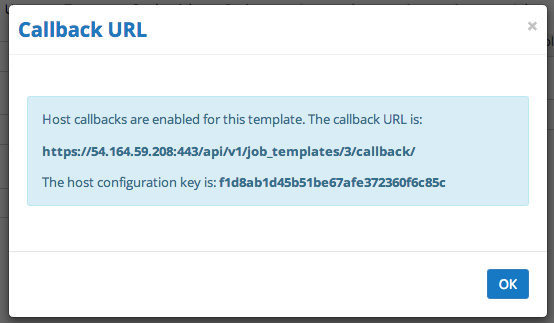

Host callbacks are enabled for this template. The callback URL is: /api/v1/job_templates/3/callback/
The host configuration key is: ``` f1d8ab1d45b51be67afe372360f6c85c```


## Creating the Provisioning Job Template

This job template will be used to spin up the EC2 infrastructure using the infra.yml playbook.  

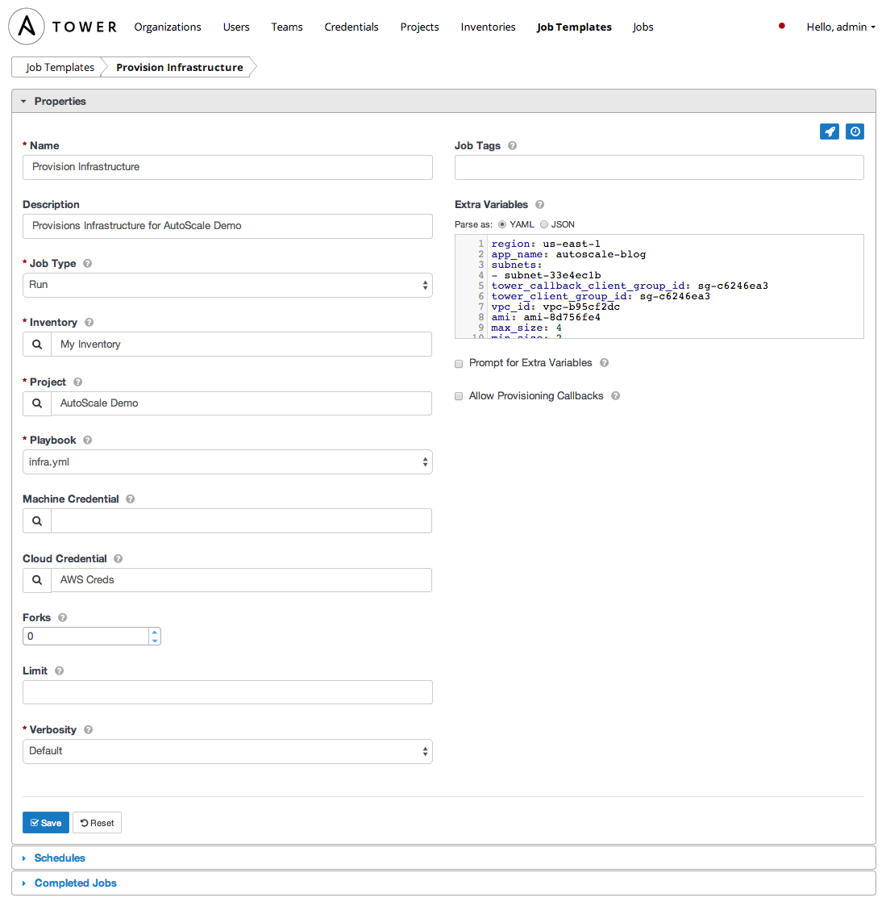

In the Extra Variables section, paste in the following in, making sure you substitue the key_name, vpc_id, tower_group, tower_address, template_id, and host_config_key with the values we discovered earlier. If you're using a region other than us-east1, you'll have to substitue the proper AMI for a RHEL 6.5 instance as well.


	region: us-east-1
	app_name: autoscale-blog
	subnets:
	- subnet-33e4ec1b
	tower_callback_client_group_id: sg-c6246ea3
	tower_client_group_id: sg-c6246ea3
	vpc_id: vpc-b95cf2dc
	ami: ami-8d756fe4
	max_size: 4
	min_size: 2
	desired_capacity: 2
	key_name: jmartin-autoscale-blog
	tower_address: 10.0.1.131
	template_id: 3
	host_config_key: f1d8ab1d45b51be67afe372360f6c85c
	instance_size: m1.small


Assign the AWS credentials we created earlier using the **Cloud Credentials** dialog.  When launched,  template will create the following items:

### EC2 Infrastructure 

| Item  | Description |
|-----------------------------|------------------------------|
| App Security Group | Self-referencing group that allows members of this group to access all ports of members. |
| Load Balancer | A load balancer for the app servers. |
| Launch Configuration | A configuration used by the AutoScale group. |
| AutoScale Group | Defines the number of instances and the load balancer membership. |
| Scale Up & Down Policies | Policies that when alarmed will dictate change to occur on AutoScale group.  |
| Scale Up & Down Alarms | Alarms that will trigger their relative scale up and down policies. |


## Running the Playbooks

First we'll need to provision the AWS infrastructure, so find the **provisiong infrastructure** template and click the launch icon to kick it off.  
The following happens automatically:

1. The EC2 infrastructure playbook is run and all EC2 components described in the EC2 infrastructure table are created.
2. The AutoScale Group is created and the initial 2 instances are launched
3. The instances will both download the script you placed in S3 and run it
4. That script phones home to Tower and requests Tower to configure the server with the template ID (in this case, the Configure Application template) that is in the URL.
5. Tower checks to make sure that the instances are part of the inventory specified in the job template and also validates the host configuration key.
6. Tower then configures the instances with the Configure Application template.
7. The instances are configured and running your application


